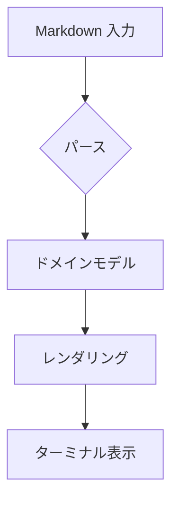
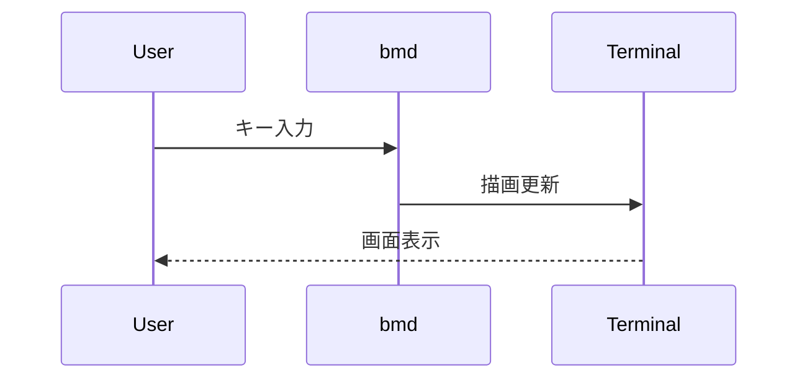
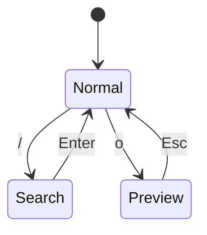

# Mermaid 図表

[← 目次](./00-index.md)

Mermaid フェンスドブロックはターミナル画像プロトコルでインライン表示されます。対応ターミナルがない場合は Unicode ハーフブロックにフォールバックします。

## フローチャート

## シーケンス図

## 状態図

## プレビューオーバーレイ

スクロール中は画像描画が一時停止し、停止後約 100ms で再開します。図表リンクを `n` で選択し `o` でフローティングプレビューを開き、`Esc` で閉じてください。

## 確認項目

- [ ] フローチャートがインライン表示される
- [ ] シーケンス図・状態図が表示される
- [ ] スクロール中にちらつきが抑制される
- [ ] 図表リンクからプレビューオーバーレイが開く
- [ ] `Esc` / `o` でプレビューが閉じる
