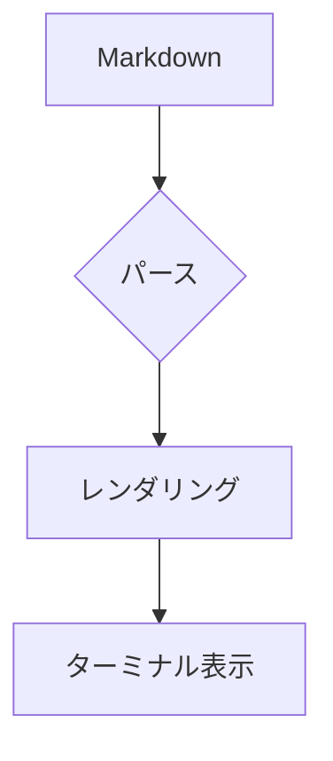

# bmd GFM サンプル

GitHub Flavored Markdown（GFM）の拡張を含むサンプルです。**太字**、*斜体*、`インラインコード`、~~取り消し線~~ を混在させています。

[[TOC]]

## リンク

[GitHub](https://github.com) を開くには `n` でリンクを選択し `o` を押してください。

スタンドアロン URL も自動リンク化されます: https://github.com

## タスクリスト

- [ ] 未完了タスク
- [x] 完了タスク
- [ ] ネスト付き親タスク
  - [x] 完了した子タスク
  - [ ] 未完了の子タスク

## 箇条書き・番号付きリスト

- 箇条書き項目 A
- 箇条書き項目 B
  - ネストされた項目
- 箇条書き項目 C

1. 番号付き 1
2. 番号付き 2
3. 番号付き 3

## GFM アラート

> [!NOTE]
> これは GFM スタイルの Note アラートです。

> [!TIP] ヒント
> Obsidian 形式のインラインタイトルもサポートします。

> [!WARNING]
> 警告メッセージの例です。
> 複数行の本文も続けて書けます。

## コードブロック

```rust
fn main() {
    println!("Hello, bmd!");
}
```

## テーブル

| 名前 | 説明 | バージョン |
|------|------|:----------:|
| ratatui | TUI フレームワーク | 0.30 |
| pulldown-cmark | Markdown / GFM パーサ | 0.13 |
| merman | Mermaid レンダラ | 0.6 |

| 短い | とても長い説明文が入るカラム | 値 |
|:-----|:-----------------------------|---:|
| A | これは折り返しのテストです | 1 |
| B | 日本語の文章も正しく折り返されます | 2 |

## 脚注

GFM 脚注の例です[^footnote-sample]。

[^footnote-sample]: これは脚注の本文です。複数行も書けます。

## Mermaid



## 画像

Markdown 画像は mermaid と同様にターミナル画像プロトコルで表示されます（ローカルファイルのみ対応）。


---

以上です。
