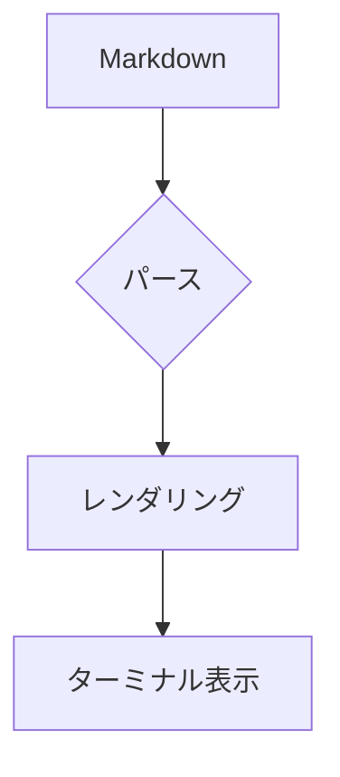

# bmd サンプル

これは **太字** と *斜体* と `インラインコード` を含む段落です。

## リンク

[GitHub](https://github.com) を開くには `n` でリンクを選択し `o` を押してください。

- 箇条書き項目 A
- 箇条書き項目 B
  - ネストされた項目
- 箇条書き項目 C

1. 番号付き 1
2. 番号付き 2
3. 番号付き 3

## コードブロック

```rust
fn main() {
    println!("Hello, bmd!");
}
```

## テーブル

| 名前 | 説明 | バージョン |
|---|---|---|
| ratatui | TUI フレームワーク | 0.30 |
| pulldown-cmark | Markdown パーサ | 0.13 |
| merman | Mermaid レンダラ | 0.6 |

| 短い | とても長い説明文が入るカラム | 値 |
|---|---|---|
| A | これは折り返しのテストです | 1 |
| B | 日本語の文章も正しく折り返されます | 2 |

## Mermaid



---

以上です。
