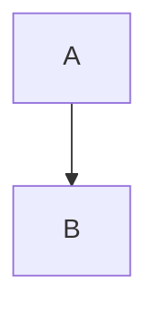

# Kitchen sink

Every block and inline kind bmd renders, used by render and app invariant tests.
**Bold**, *italic*, ~~strike~~, `code`, H~2~O, x^2^, <https://example.com/auto>,
and a hard break here\
followed by a very long line that must wrap at narrow widths because it keeps going and going well past eighty columns.

[[TOC]]

## Links and footnotes

See [the site](https://example.com "Title"), [next section](#tables), and
[another doc](./other.md). A footnote[^note] and another[^long].

[^note]: Short footnote body.
[^long]: Longer footnote with **markup** and a [link](https://example.org).

### Level three

#### Level four

##### Level five

###### Level six

## Tables

| Left | Center | Right |
|:-----|:------:|------:|
| a [cell link](https://example.net) | `code` | 1 |
| a much longer cell that has to wrap when the terminal is narrow | **b** | 22 |

## Lists

- item one
- item two
  - nested with [link](https://nested.example)
    1. ordered deep
- [ ] open task
- [x] done task

3. starts at three
4. four

Term
: Definition with *emphasis*.

## Quotes and callouts

> Plain quote
>
> > Nested quote

> [!NOTE]
> Note body with `code`.

> [!TIP]
> Tip body.

> [!IMPORTANT]
> Important body.

> [!WARNING]
> Warning body.

> [!CAUTION]
> Caution body.

## Code and math

```rust
fn main() {
    println!("hello {}", 42);
}
```

```
plain block without a language
```

Inline math $e^{i\pi} + 1 = 0$ in text.

$$
\int_0^1 x^2 \, dx = \frac{1}{3}
$$

## Media




---

Final paragraph after a rule.
